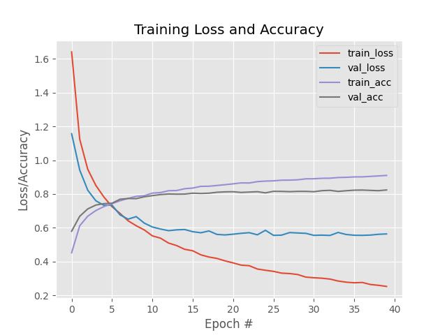

# MiniVGGNet-in-Keras
In this project we recreate the MiniVGGNet architecture in Keras / Tensorflow and run it against
the cifar10 dataset to see if we can get some actual good results. We try running this
same dataset here: https://github.com/reedajohns/Simple-CNN-using-Keras-and-Tensorflow, but we
used a very simple CNN and did not get good results (as expected), so let's see if we can beat that
with a better CNN!

## Description
GGNet was first introduced in 2014 by [Simonyan and Zisserman](https://arxiv.org/abs/1409.1556). They show the power of using
small (3x3) filters (used throughout entire architecture) trained to high depths (>16 layers). We wont be running the enitre
VGG net in this project, but rather a miniVGGNet, that uses both natch normalization and dropout layers.

A visual representation of our MiniCGGNet can be seen below (from [Pyimagesearch](https://pyimagesearch.com/2021/05/22/minivggnet-going-deeper-with-cnns/?_ga=2.14529588.2094560864.1648096932-895121412.1648096932)):  


### Model Architecture in Python (using Keras / Tensorflow)
The code for this model can be found in 'scripts/fundamentals/neuralnet/architectures.py' and is essentially created in Keras
with these lines of code:

```buildoutcfg		
		# (1) Add first CONV => RELU => CONV => RELU => POOL layers
		# "same" means the output layer H and W will be same as input
		model.add(Conv2D(32, (3, 3), padding="same",
						 input_shape=input_shape))
		model.add(Activation("relu"))
		model.add(BatchNormalization(axis=chanDim))
		model.add(Conv2D(32, (3, 3), padding="same"))
		model.add(Activation("relu"))
		model.add(BatchNormalization(axis=chanDim))
		model.add(MaxPooling2D(pool_size=(2, 2)))
		model.add(Dropout(0.25))

		# (2) Add second CONV => RELU => CONV => RELU => POOL layers
		# "same" means the output layer H and W will be same as input
		model.add(Conv2D(64, (3, 3), padding="same"))
		model.add(Activation("relu"))
		model.add(BatchNormalization(axis=chanDim))
		model.add(Conv2D(64, (3, 3), padding="same"))
		model.add(Activation("relu"))
		model.add(BatchNormalization(axis=chanDim))
		model.add(MaxPooling2D(pool_size=(2, 2)))
		model.add(Dropout(0.25))

		# Add fully connected layers
		# Need to flatted from 2D to 1D vectore
		model.add(Flatten())
		# We'll go down to 512 nodes
		model.add(Dense(512))
		#  Add ReLu act
		model.add(Activation("relu"))
		# Batch normilzation and dropout layers
		model.add(BatchNormalization())
		model.add(Dropout(0.5))
		# Narrow down to number of classes
		model.add(Dense(classes))
		# And finally the softmax for classifying
		model.add(Activation("softmax"))
```

## Results

### Cifar 10 Dataset
Code can be found in 'scripts/cifar10_minivggnet_cnn.py.  

For this dataset we use a MiniVGGNet architecture with 40 epochs and a learning
rate (SGD) of 0.01. We also introduce a decay component to the learning rate, a momentum of 0.9, and add Nesterov acceration.


The results summary can be seen below:
```buildoutcfg
              precision    recall  f1-score   support

    airplane       0.85      0.85      0.85      1000
  automobile       0.92      0.91      0.91      1000
        bird       0.74      0.73      0.73      1000
         cat       0.70      0.65      0.67      1000
        deer       0.78      0.83      0.80      1000
         dog       0.77      0.72      0.74      1000
        frog       0.81      0.90      0.85      1000
       horse       0.89      0.86      0.87      1000
        ship       0.90      0.91      0.91      1000
       truck       0.89      0.90      0.89      1000

    accuracy                           0.82     10000
   macro avg       0.82      0.82      0.82     10000
weighted avg       0.82      0.82      0.82     10000
```

The training loss and accuracy plot for both the training and validation 
datasets can be seen below:



We see by examining the plot of loss and accuracy that we are able to get > 80% accuracy using MiniVGGNet! Which isn't the best,
but is still way better than out ~60% results using the simplest CNN. We see that the
validation loss / accuracy flat line around epoch 30. We don't see quite as much overfitting here
as the previous attempt either.

## Getting Started

### Dependencies

See requirements.txt

### Installing

#### Clone the project:
```
git clone git@github.com:reedajohns/MiniVGGNet-in-Keras.git
```

### Executing program

Open terminal and run either command:
```
 python cifar10_minivggnet_cnn.py --output ../media/keras_minivggnet_cnn_cifar.png --model ../models/minivggnet_weights.hdf5
```

## Authors

Contributors names and contact info

Reed Johnson (https://www.linkedin.com/in/reed-a-johnson/)

## Version History

* 0.1
    * Initial Release

## License

This project is licensed under the GNU GENERAL PUBLIC License - see the LICENSE.md file for details

## Acknowledgments

Inspiration, code snippets, etc.
* [Pyimagesearch](https://pyimagesearch.com/2021/05/22/minivggnet-going-deeper-with-cnns/?_ga=2.14529588.2094560864.1648096932-895121412.1648096932)